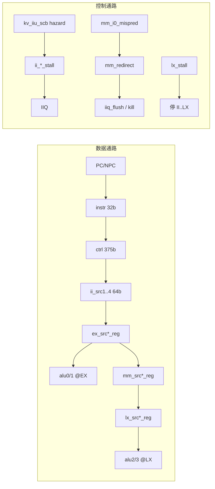

# AX46MPV Spec

**顶层：** `kv_core.v` = `kv_ifu` + `kv_bpu` + `kv_ipipe` + `kv_lsu` + `kv_mdu` + `kv_cmt` + TLB/Cache

**架构：** 8 级顺序双发流水线，每周期最多 2 条指令（`i0` / `i1`）。级间 **FQ(4)**、**IIQ(4)** 为双宽解耦 FIFO，不计入 8 级。

---

## 总览：8 级划分

| 级 | 名称 | RTL 前缀 | 主模块 | posedge 边界 |
|----|------|----------|--------|--------------|
| 1 | **IF** | `f0`, `f1` | `kv_ifu` | VA/PA、发 I$/ILM 请求 |
| 2 | **IC** | `f2` → **FQ(4)** | `kv_ifu`, `kv_fq` | 取指返回、入队（双宽 FIFO） |
| 3 | **ID** | `id_*`, `ifd_*` | `kv_dec`, `kv_uins_ctl` | 译码；push **IIQ(4)** |
| 4 | **IS** | `ii_*` | `kv_iiq_wrap`, `kv_iiu`, `kv_iiu_scb` | pop IIQ；发射、冒险 |
| 5 | **EX** | `ex_*` | `kv_ipipe` | early 执行、LS/MDU 发起 |
| 6 | **MM** | `mm_*` | `kv_ipipe` | 分支解析、load 数据并入 |
| 7 | **LX** | `lx_*` | `kv_ipipe`, `kv_lsu` 响应 | late 执行、访存返回 |
| 8 | **WB** | `wb_*` | `kv_ipipe`, `kv_cmt` | 写寄存器、退休 |

---

## 硬件框图

```
                         ┌────────── kv_bpu ──────────┐
                         │ BTB/BHT/RAS → pred_npc    │
                         └────────────┬──────────────┘
                                      │ pred_taken, pred_npc
  ILM / ICU(I$)                         ▼
      ▲                    ┌─────────────────────────────┐
      │  icu/ilm resp      │  S1 IF          S2 IC       │
      └────────────────────│  f0 → f1(ITLB) → f2 → FQ(4)│
                           └──────────┬──────────────────┘
                                      │ ifu_i0/i1 (双路)
                                      ▼
                           ┌─────────────────────────────┐
                           │  S3 ID   kv_dec (组合)       │
                           │          kv_uins_ctl        │
                           └──────────┬──────────────────┘
                                      │ id_ready
                                      ▼
                           ┌─────────────────────────────┐
                           │  IIQ(4) FIFO                 │
                           └──────────┬──────────────────┘
                                      ▼
                           ┌─────────────────────────────┐
                           │  S4 IS   kv_iiu + kv_iiu_scb │
                           │  XRF/FRF读 + bypass + hazard │
                           └──────────┬──────────────────┘
                                      │ ii_src1..4, ctrl
          ┌───────────────────────────┼───────────────────────────┐
          ▼                           ▼                           ▼
   ┌─────────────┐            ┌─────────────┐              ┌─────────────┐
   │ S5 EX       │            │ kv_lsu      │              │ kv_mdu      │
   │ alu0/1      │──ls_req───▶│ (EX 入队)   │──ls_resp────▶│ EX req      │
   │ bru0/1      │            └─────────────┘              │ LX resp     │
   │ bitmanip0   │                                          └─────────────┘
   └──────┬──────┘
          ▼
   ┌─────────────┐     mm_redirect ──▶ IFU redirect_pc
   │ S6 MM       │     mm_btb_update ─▶ kv_bpu
   │ 分支误判     │
   │ load 快路径  │
   └──────┬──────┘
          ▼
   ┌─────────────┐
   │ S7 LX       │◀── lx_stall（全局后端停）
   │ alu2/3      │
   │ bru2/3      │
   │ ls/mdu/csr  │
   └──────┬──────┘
          ▼
   ┌─────────────┐
   │ S8 WB       │──▶ XRF/FRF we
   │ kv_cmt退休  │
   └─────────────┘
```

---

## 数据通路 vs 控制通路



- **数据：** `instr` → `id_ctrl` → `ii_ctrl` → `ex/mm/lx/wb_ctrl` 随指令走；操作数 `ii_src*` → `ex_src*_reg` → `mm_src*_reg` → `lx_src*_reg`。
- **控制：** `kv_iiu_scb` 在 IS 级产生 `stall`/`bypass`/`late`；`mm_redirect`/`wb_kill` 在 MM/WB 级 flush；`lx_stall` 冻结 II→LX 全部流水寄存器。

---

## S1 — IF（取指地址）

**文件：** `kv_ifu.v`  
**寄存器：** `f0_valid`, `f0_pc`, `f0_bblk_start` → `f1_valid`, `f1_va`, `f1_pa`

| 动作 | 实现 |
|------|------|
| 下一 PC | redirect 用 `redirect_pc`；正常用 BPU `target_pc`；resume/retry 单独路径 |
| 发请求 | `f1_valid` 成立后选 ILM（`ifu_ilm_req_*`）或 ICU（`ifu_icu_req_*`） |
| ITLB | `ifu_itlb_req_valid` / `ifu_mmu_req_valid`，miss 进 `ST_FILL_TLB` FSM |
| 背压 | `ipipe_ifu_stall`、`fq_full_stall`、`fetch_stall` |

**输出到 S2：** `f1` 推进为 `f2`（`f2_valid_nx = f1_valid & ~f2_kill`）。

---

## S2 — IC（取指数据）

**文件：** `kv_ifu.v`, `kv_fq`  
**寄存器：** `f2_valid`, `f2_va`, fetch 返回的 `fetch_resp_inst`

| 动作 | 实现 |
|------|------|
| 等 I$/ILM | `f2_cache_miss` → `ST_MH`；`f2_itlb_miss` → TLB fill |
| 对齐/拆包 | RVC：`ifu_i0_instr_16b`；双发时 `inst0_issue`/`inst1_issue` |
| 异常/Ecc | `f2_xcpt`, `fq_wr_xcpt` 打入 FQ |
| 入队 | `fetch_valid` → `kv_fq`（`FQ_DEPTH=4`） |

### FQ — Fetch Queue（IC↔ID，`kv_fq.v`）

夹在 **S2 与 S3** 之间，深度 4、双宽（每拍最多出 `fq_i0`/`fq_i1` 两条）。

```
  IC (f2 fetch_resp)                    ID (kv_dec)
       │  fq_wr                           │ fq_i0/i1_ready = id_ready[*]
       ▼                                  ▼
  ┌─────────────────────────────────────────────┐
  │  s0[0..3]  环形 RAM，每项 75b                │
  │  wptr=s8   rptr=s3                          │
  │  每拍 fq_wr 入队 1 bundle（最多 4×16b 指令）   │
  │  每拍 fq_rd  出队 0~2 条 → fq_i0 / fq_i1     │
  └─────────────────────────────────────────────┘
```

| 信号 | 方向 | 含义 |
|------|------|------|
| `fq_wr` | IC→FQ | `fetch_valid` 时写入 `s0[wptr]` |
| `fq_rd` | FQ→ | `fq_i0_ready & fq_i0_valid`（及 i1）时推进 rptr |
| `fq_i0_valid` / `fq_i1_valid` | FQ→ID | 队头 1~2 条指令 |
| `fq_i0_ready` | ID→FQ | `ifu_i0_ready` ← `id_ready[0]` 等 |
| `fetch_kill` | 控制 | redirect 时清 wptr/rptr |

**满：** `fq_full_stall = (ost_max_num == FQ_DEPTH) & ~redirect` → 停 S1 取指。  
**项内容：** `{valid[3:0], bblk_ecc, xcpt[3:0], bblk_end, bblk_start, inst[63:0]}`。

**FQ → S3：** `ifu_i0_valid = fq_i0_valid`；`ifu_i0_ready` 由 `id_ready[0]` 决定（ID 能收才 pop）。

---

## S3 — ID（译码）

**文件：** `kv_dec.v`, `kv_uins_ctl.v`（在 `kv_ipipe` 内）

| 动作 | 实现 |
|------|------|
| 译码 | **组合逻辑：** `ifd_i0_instr` → `kv_dec` → `id_i0_ctrl[374:0]`、imm、FU 位 `fu[*]` |
| 槽位 | `id_i0_alive` / `id_i1_alive`（`kv_uins_ctl` 状态机） |
| 微序列 | `kv_uins_ctl`：EX9 lookup、`id_uinstr_sel` 替换 i0 控制字 |
| 背压 IF | `ifd_stall[0]`：vector resume / EX9 wait；`ifd_stall[1]` 级联 i1 |
| 推进 IIQ | `iiq_w_valid = {id_i1_alive,id_i0_alive}`，`iiq_w_ready = id_ready` |

**输出：** `id_i0_pc`, `id_i0_ctrl`, `id_i0_instr`, `id_i0_pred_info` 等 → **写入 IIQ**（详见 S4 IIQ 小节）。

---

## S4 — IS（发射）

**文件：** `kv_iiq_wrap.v`, `kv_iiu.v`, `kv_iiu_scb.v`

### IIQ — Issue Instruction Queue（ID↔IS，`kv_iiq.v`）

夹在 **S3 与 S4** 之间，深度 4、双宽（每拍最多 push/pop 各 2 项）。

```
  ID                                     IS (kv_iiu)
   │  iiq_w_valid = {id_i1_alive,id_i0_alive}     │ iiq_r_ready = ii_ready
   │  iiq_w_ready = id_ready                      │ iiq_r_valid = ii_valid
   ▼                                              ▼
┌──────────────────────────────────────────────────────┐
│  s0[3:0]  valid-bit 占用掩码                          │
│  4×IIQ_WIDTH 数据 RAM（PC/NPC/ctrl/imm/pred/…）       │
└──────────────────────────────────────────────────────┘
       │ pop 后 kv_iiq_wrap 再跑 kv_dec → ii_i0/i1_ctrl
       ▼
```

| 信号 | 连接 |
|------|------|
| `iiq_w_ready` | `= id_ready` |
| `iiq_r_valid` | `= ii_valid` |
| `iiq_r_ready` | `= ii_ready` — `~(lx_stall \| ii_*_stall)` |
| `iiq_flush` | `mm_redirect_final \| wb_redirect \| resume` |

`w_ready[i] = |(~s0 & s4)`（未满可写）；`r_valid[i] = |(s0 & s3)`（队头有效可读）。

**背压：** IS stall 时 `ii_ready=0` 不 pop，但 ID 在 `iiq_w_ready=1` 时仍可 push；写满 4 项后 `id_ready=0`，FQ 亦停 pop（见时序图 T16）。

### 4.1 流水行为

| 动作 | 实现 |
|------|------|
| 出队 | `ii_valid` ← IIQ；`ii_ready[0]=~(lx_stall\|ii_i0_stall)` |
| 读寄存器 | `rf_raddr1..4`；组合读出后经 bypass mux → `ii_src1..4` |
| 打 EX 包 | `ii_ex_i0_ctrl` ← `ii_i0_ctrl` + bypass/late/nbload 位 |
| FPU 送数 | `fpu_i0_valid` @ IS，`fpu_i0_frs*` 旁路选择 |

**IIQ flush：** `iiq_flush = mm_redirect_final | wb_redirect | resume`

### 4.2 旁路网络（IS 级操作数）

`kv_iiu_scb` 为每个源寄存器算 **18b bypass 向量**（高 9b=src2/rs2 侧，低 9b=src1/rs1 侧），`kv_ipipe` 中 `rs1_rf_rdata` 用 `ii_xrs_bypass[8:0]`：

| bypass[i] | 数据源 |
|-----------|--------|
| 0 | XRF `rf_rdata`（本拍读口） |
| 1 | `ex_rd1_wdata` |
| 2 | `ex_rd2_wdata` |
| 3 | `mm_rd1_wdata` |
| 4 | `mm_rd2_wdata` |
| 5 | `lx_rd1_wdata` |
| 6 | `lx_rd2_wdata` |
| 7 | `wb_rd1_wdata` |
| 8 | `wb_rd2_wdata` |

`rs2` 用 `ii_i0_bypass[17:9]`，逻辑相同。`rs3/rs4`（i1 操作数）用 `ii_i1_bypass` / `ii_i1_xrs_bypass`。

**scb 选路算法（以 i0 的 rs1 为例）：**

```verilog
// kv_iiu_scb.v — 按命中 EX/MM 的 rd 选 6b 延迟标签 s188
s188 = ~ii_rs_ren[1] ? 6'h01 :
       rs1_match_ex_rd2 ? s176 :
       rs1_match_ex_rd1 ? s174 :
       rs1_match_mm_rd2 ? s181 :
       rs1_match_mm_rd1 ? s178 : 6'h01;
ii_i0_bypass = {s190, s187};   // 18b → kv_ipipe 拆成 xrs1/xrs2
```

`s174/s176/...` 由生产者 FU 类型（`ii_ex_rd*_fu`、load、FMIS/FMV 等）编码，决定从哪一级 forward。

**随指令带入后级的 bypass 域：**

| 信号 | 位宽 | 用途 |
|------|------|------|
| `ii_i0_mm_bypass` | 12 | 打入 `ex_mm_i0_ctrl[77+:12]`，MM 级 `mm_src*` mux |
| `ii_i1_ex_bypass` | 4 | EX 级 i1 `alu1_op*` 选 `ex_src3/4` 或 `alu0_bresult` |
| `ii_i1_lx_bypass` | 4 | LX 级 i1 `alu3` 选 `lx_src3/4` 或 `ls_resp_bresult` |
| `ii_mdu_bypass` | 16 | MDU 操作数 `mdu_req_op0/1` mux |

**MM 级旁路**（`mm_i0_bypass[11:0]`，在 `mm_ctrl_en` 时锁进 ctrl）：

| bit | `mm_src1` | `mm_src2` |
|-----|-----------|-----------|
| 0 | mm_src1_reg | — |
| 1 | lx_rd1 | — |
| 2 | lx_rd2 | — |
| 3 | wb_rd1 | — |
| 4 | wb_rd2 | — |
| 6 | — | mm_rd1_wdata |
| 7–10 | — | lx_rd1/2, wb_rd1/2 |

**LS 基址旁路：** `ii_i0_ls_base_bypass` — 若 rs1 命中 **EX** 的 rd，强制为 0（基址不能从 EX forward，只能从 MM+）。

### 4.3 Late 判定

Late = 该操作数生产者结果 **在 LX 才可用**，EX 级不算 ALU。

```verilog
// kv_iiu_scb.v
ii_i0_late = (ii_rs_ren[1] & ~s188[0]) | (ii_rs_ren[2] & ~s191[0]);
```

- `s188[0]=1` → 可从 EX forward（**early**）
- `s188[0]=0` → 必须等 LX（**late**）

**i1 late 额外条件：**

- `calu_pair` 跟随 i0 的 late
- 同拍 i0 load + i1 RAW（`s199[1]`/`s200[1]`）
- `fu[16/17]` 向量相关（标量可忽略）

**打入 EX ctrl：**

```verilog
ii_ex_i0_ctrl[134] = ii_i0_ctrl[142] & ~ii_i0_late;  // early ALU @ EX
ii_ex_i0_ctrl[149] = ii_i0_ctrl[142] &  ii_i0_late;  // late ALU @ LX
```

late 标志链：`[149] → ex_mm[164] → mm_lx[146] → mm_lx[183]`，LX 上 `alu2_op*=lx_src*` 当 `[183]`。

**`ii_ex_rd1_fu` 生产者标签**（`kv_iiu.v`，供 scb 匹配）：

| bit | 条件 | 含义 |
|-----|------|------|
| [0] | `fu[0] & ~late` | early ALU |
| [5] | `fu[0] & late` | late ALU |
| [1] | `fu[2]\|fu[4]` | Load/Store |
| [2] | `fu[5]` | FPU |
| [3] | `fu[6]` | MDU |
| [4] | `fu[7]` | CSR |

### 4.4 Hazard 与 Stall

**汇总方程（`kv_iiu.v`）：**

```verilog
ii_i0_stall = ii_i0_raw_hazard | ii_i0_struct_hazard | ii_i0_waw_hazard
            | ii_i0_f_raw_hazard | ii_i0_f_struct_hazard | ii_i0_f_waw_hazard
            | throttling_stall | presync_stall | ... ;

ii_i1_stall = ii_i0_stall | ii_i1_raw_hazard | ii_i1_struct_hazard | ii_i1_waw_hazard
            | ii_i0_singleissue | ii_i1_ctrl[277]   // CSR/fence 强制单发
            | ii_i1_ctrl[76];                      // 短偏移未预测分支不能当 i1
```

#### RAW（`ii_i0_raw_hazard`）

- 比较 `ii_rs1/2/3/4` 与 `ii_ex_rd1/2`、`mm` 中在途 dest（`rs1_match_ex_rd1` 等）。
- 按生产者 FU 类型（`s252..s295`）决定能否同拍 bypass；不行则 stall。
- **同拍 i0→i1 放宽**（`s251`）：例如 i0 early ALU → i1 early ALU（双方 `~late`）；i0 load → i1 ALU/BR（`fu[3]&i1 fu[0/8]`）。

#### WAW（`ii_i0_waw_hazard` / `ii_i1_waw_hazard`）

- i0：rd1/rd2 与 EX/MM/LX/WB 在途写冲突（`s227..s242` × busy 位 `s95..s102`）。
- i1：**同周期** `ii_i0_rd1 == ii_i1_rd1` 且双写 → stall。

#### Structural（`ii_i0_struct_hazard`）

| 条件 | 原因 |
|------|------|
| `fu[2/4/22] & ~ls_issue_ready` | LSU 发射口满（`kv_lsuop`） |
| `fu[6] & ~mdu_req_ready` | MDU 忙 |
| `fu[6] & s95/s96` | MDU 管线占位冲突 |
| `fu[9] & ii_i0_late` | StackSafe + late ALU |
| `fu[2] & load_mem_hazard` | 访存结构冲突 |
| `fu[4] & store_mem_hazard` | 同上 |

**i1 额外 struct：**

| 条件 | 原因 |
|------|------|
| `ii_i1_fu[7]` | CSR 独占 i1 槽 |
| `ii_i1_fu[6] & ii_i0_fu[6]` | 双 MDU |
| `ii_i1_fu[5] & ii_i0_fu[5]` | 双 FPU |
| `(i1 LS) & (i0 late BR)` | late 分支不能与 LS 双发 |
| `ii_i0_fu[2/4] & ii_i1_fu[23]` | mem hazard 扩展 |

#### NBLOAD hazard

- `ii_i0_ex_nbload_hazard` / `ii_i0_mm_nbload_hazard`：非阻塞 load 在 EX/MM 的特殊 RAW。
- 打入 ctrl：`ii_ex_i0_ctrl[191]`、`[189]`，在 MM 可能触发 `mm_i0_nbload_hazard` replay。

---

## S5 — EX（执行 / 发起）

**文件：** `kv_ipipe.v`；执行单元在 `kv_core.v` 例化

**寄存器：** `ex_valid`, `ex_src{1,2,3,4}_reg`, `ex_i0_pc`, `ex_i0_ctrl[223:0]`

| 动作 | 实现 |
|------|------|
| Early ALU i0 | `alu0_op0/1 = ex_src1/2_reg`；`ex_rd1_wdata` ← `alu0_result` if `ctrl[134]` |
| Early ALU i1 / CALU | `alu1_op*`；`ex_i0_ctrl[81]` 时 i1 用 `alu0_bresult` |
| Bitmanip | `bitmanip0` → `ex_rd1_wdata` if `[135]` |
| Branch i0/i1 | `bru0/1`：`bru0_pc=ex_i0_pc`；`ex_mm_i0_val` ← `bru0_target` |
| 发起 LSU | `ls_req_valid = ex_i0_valid & ex_i0_ls`；`ls_req_base0/1 = ex_src1/3_reg` |
| 发起 MDU | `mdu_req_valid` when `ex_*_ctrl[152] & ~lx_stall` |
| 前递 | `ex_rd1_wdata`/`ex_rd2_wdata` 同拍可供 IS bypass |

`kv_alu`/`kv_bru`：**纯组合，无内部流水**。

---

## S6 — MM（访存解析 / 分支误判）

**寄存器：** `mm_valid`, `mm_src*_reg`, `mm_i0_ctrl[215:0]`

| 动作 | 实现 |
|------|------|
| 锁操作数 | `mm_ctrl_en = ex_i0_valid & ~lx_stall` → `mm_src* <= ex_src*` |
| 分支误判 | `mm_i0_mispred = mm_i0_btb_mispred \| mm_i1_tb_mispred` |
| Redirect | `mm_i0_kill` → `mm_redirect` → IFU `redirect_pc`；`iiq_flush` |
| BTB 更新 | `mm_btb_update_p0/p1` → `kv_bpu` |
| Load 快路径 | `mm_i0_ctrl[161]` 时 `lx_src2_nx` ← `fpu_fmis_result` |
| 异常/replay | `mm_abort` → `mm_lx_*_ctrl[189]` nbload/replay 位 |

**Redirect 与 stall：** `mm_redirect_issued` 在 `lx_stall` 时推迟一拍发出，避免丢 redirect。

---

## S7 — LX（晚执行 / 访存返回）

**寄存器：** `lx_valid`, `lx_src*_reg`, `lx_i0_ctrl[204:0]`

| 动作 | 实现 |
|------|------|
| Late ALU i0 | `alu2_op* = lx_src1/2`；`lx_rd1_wdata` ← `alu2_result` if `[183]` |
| Late ALU i1 | `alu3_op*`；可 mux `ls_resp_bresult`（load-use） |
| Late branch | `bru2/3`；`lx_wb_i0_val` ← `bru2_target` if `[147]` |
| Load 结果 | `lx_rd1_wdata` ← `ls_resp_result` if `[185]` |
| MDU 结果 | `lx_rd1_wdata` ← `mdu_resp_result` if `[186]` |
| CSR 读 | `lx_rd1_wdata` ← `csr_ipipe_resp_rdata` if `[180]` |
| 全局 stall | `lx_stall = lx_ls_stall \| …`；为 1 时 II/EX/MM/LX 均不推进 |

**EX ∥ LX 重叠：** 同周期 EX 上年轻 early（alu0/1）+ LX 上年老 late（alu2/3），issue 仍 ≤2。

---

## S8 — WB（写回 / 退休）

**寄存器：** `wb_valid`, `wb_rd1_wdata_reg`, `wb_i0_ctrl[157:0]`

| 动作 | 实现 |
|------|------|
| 推进 | `wb_valid <= lx_wb_valid` when `wb_valid_en & ~lx_stall` |
| 写 XRF | `rf_we1 = wb_i0_doable & wb_i0_ctrl[135]`；`rf_wdata1 = wb_rd1_wdata` |
| 写 FRF | `frf_we1/2/3` 独立 FPU ctrl |
| 退休 | `wb_i0_retire` → `kv_cmt`：异常、`inst_retire`、perf |
| Flush | `wb_kill` 取消本拍及 younger 指令的副作用 |

---

## 控制信号一览

| 信号 | 产生级 | 作用 |
|------|--------|------|
| `id_ready` | ID | FQ pop、IIQ push |
| `ii_i0_stall` | IS | 停 i0；级联停 i1 |
| `lx_stall` | LX/LSU | 停 II、EX、MM、LX |
| `mm_redirect` | MM | flush + IFU 改向 |
| `wb_kill` | WB/cmt | 陷阱 kill |
| `iiq_flush` | MM/WB | 清空 IIQ |
| `ipipe_ifu_stall` | ipipe | 停前端 |

---

## 执行单元与流水级对照

| 单元 | 模块 | 占用级 | 计算特性 |
|------|------|--------|----------|
| ALU ×2 early | `u_alu0/1` | EX | 组合 1 拍 |
| ALU ×2 late | `u_alu2/3` | LX | 组合 1 拍 |
| BRU ×2 early | `u_bru0/1` | EX 算，MM 判 | 组合 |
| BRU ×2 late | `u_bru2/3` | LX | 组合 |
| Bitmanip ×2 | `u_bitmanip0/1` | EX | 组合 |
| LSU | `kv_lsu` | EX 请求，LX 响应 | 多拍 |
| MDU | `kv_mdu` | EX 请求，LX 响应 | 多拍 |
| FPU | `kv_fpu` | IS 入，LX/WB 出 | 多拍 |

---

## 时序图

**读图约定**

- 列 = 时钟周期 `C0, C1, …`（posedge 采样边界）
- 行 = 8 级流水：`IF → IC → ID → IS → EX → MM → LX → WB`
- 单元格内写指令名（`A/B/C…`）或事件（`stall`、`kill`、`byp`）
- `FQ`/`IIQ` 有内容时在级间用 `[A]` 表示 FIFO 中等待
- `→` 表示组合前递同周期可见；`══` 表示多拍未完成

### T0 — 单条指令填满 8 级（理想 I$ hit）

```
        C0   C1   C2   C3   C4   C5   C6   C7   C8
IF       A
IC            A
ID                 A
IS                      A
EX                           A    alu0/bru0 组合
MM                                A    分支判定向量
LX                                     A    结果/LS 合入
WB                                          A    rf_we, retire
```

- `C3` IS：读 XRF，`ii_src*` 锁入 `ex_src*_reg`（下一拍 EX）。
- `C4` EX：`ex_rd1_wdata` 组合有效，同拍可供 younger IS bypass（`bypass[1]`）。
- `C7` LX：`lx_rd1_wdata` 定稿；`C8` WB：`rf_we1` 写 XRF。

---

### T1 — 双发稳态（每周期 IS 发射 A=i0, B=i1）

```
        C0   C1   C2   C3   C4   C5   C6   C7   C8   C9
IF       A    B    C    D
IC            A    B    C    D
ID                 A,B  C,D
IS                      A,B  C,D  (ii_valid[1:0]=2'b11)
EX                           A,B  C,D
MM                                A,B  C,D
LX                                     A,B  C,D
WB                                          A,B  C,D
```

- `A` 占 i0 槽（`alu0`/`bru0`/`ls_req`）；`B` 占 i1 槽（`alu1`/`bru1`）。
- `ii_i1_stall=0` 时 `ii_ready[1]=1`；i0 stall 会级联停 i1。

---

### T2 — EX 旁路（early ALU → 下一条 IS 读同一 rd）

```
指令:  A  add x1, x2, x3     (early, rd=x1)
       B  add x4, x1, x5     (rs1=x1, 依赖 A)

        C3   C4   C5   C6
IS       A
EX            A → ex_rd1
IS                 B  rs1 ← bypass[1]=ex_rd1_wdata  (同拍组合)
EX                      B → ex_rd1
```

- scb：`rs1_match_ex_rd1`，`s188[0]=1` → **非 late**，`ii_i0_raw_hazard=0`。
- 若 A 在 MM 而 B 在 IS：`bypass[3]=mm_rd1_wdata`。

**旁路延迟表（消费者位于 IS）：**

| 生产者所在级 | bypass bit | 数据信号 |
|-------------|------------|----------|
| EX i0 rd1 | [1] | `ex_rd1_wdata` |
| EX i0 rd2 / i1 | [2] | `ex_rd2_wdata` |
| MM | [3]/[4] | `mm_rd1/2_wdata` |
| LX | [5]/[6] | `lx_rd1/2_wdata` |
| WB | [7]/[8] | `wb_rd1/2_wdata` |

---

### T3 — Late ALU 路径（load 生产 → late ALU 消费）

```
指令:  A  lw   x1, 0(x2)      (load, rd=x1, 结果 @ LX)
       B  add  x3, x1, x4     (rs1=x1 → ii_i0_late=1)

        C3   C4   C5   C6   C7   C8   C9
IS       A
EX            A  ls_req_valid ──────────────┐
MM                 A                       │ kv_lsu
LX                      A  ls_resp ────────┘ lx_rd1 ← load data
IS                           B  late=1, stall? (若不能 s251 放宽)
IS                                B  (RAW 解除后发射)
EX                                     B  ctrl[149]=1, EX 不算 ALU
MM                                          B
LX                                               B  alu2 → lx_rd1
WB                                                    B  rf_we
```

- 生产者 load：`ii_ex_rd1_fu[1]=1`，`s188[0]=0` → 消费 `add` 的 `ii_i0_late=1`。
- `ii_ex_i0_ctrl[134]=0`，`[149]=1`：操作数过 `EX→MM→LX` 三级寄存器后在 **LX** 用 `alu2` 算。
- 从 **IS 发射 B** 到 **late 结果在 LX**：固定 **+3 级**（EX/MM/LX 寄存器链）。

---

### T4 — Load-use RAW stall（classic，不能 bypass）

```
指令:  A  lw   x1, 0(x2)
       B  add  x3, x1, x4     (必须等 A 的 load 数据)

        C3   C4   C5   C6   C7   C8
IS       A
EX            A  ls_req
IS                 B  ii_i0_raw_hazard=1  ii_i0_stall=1  (bubble)
IS                      B  (A@LX 有数据 / bypass[5]) 发射
EX                           B
...
```

- `rs1` 命中 EX/MM 的 load dest，且 scb 判定本拍不能 forward → **IS 插泡**。
- 解除条件：A 到 LX 且 `lx_rd1_wdata` 有效，或 MM load 快路径 `fpu_fmis` 提前。

---

### T5 — 同拍 i0 load → i1 early ALU（`s251` 放宽，不 stall）

```
指令:  A  lw   x1, 0(x2)     (i0)
       B  add  x3, x1, x5     (i1, 同拍 IS 双发)

        C3   C4   C5   C6   C7
IS       A,B  双发 (s251: fu[3]&i1 ALU 例外)
EX            A,B
MM                 A  (load 进行中)
LX                      A  ls_resp → lx_rd1
                         B  已发射；若 rs1=x1 仍可能 late 或在 LX 用 alu3+ls_resp
```

- RTL：`~(ii_i0_fu[3] & ii_i1_fu[0] & ~ii_i1_late)` 等项使 **i1 不因 i0 load RAW 停发**。
- i1 操作数可能在 LX 通过 `alu3` mux `ls_resp_bresult`（`ii_i1_lx_bypass`）。

---

### T6 — Early 分支误判（`bru0` @ EX，MM 解析）

```
指令:  A  beq  x1, x2, target   (预测 taken，实际 not taken)
       B  ...                   (错误路径)
       C  ...                   (错误路径)

        C4   C5   C6   C7   C8   C9
EX       A    bru0_target vs pred
MM            A    mm_i0_mispred=1
                  mm_i0_kill, mm_redirect
IF                      redirect_pc (顺序 NPC)
                  iiq_flush, kill B,C @ MM/LX/WB
IS                           A' 正确路径重取
```

- `mm_redirect_final` → IFU `redirect_pc`；`iiq_flush` 清 IIQ。
- 若在 `C6` 同时 `lx_stall=1`：`mm_redirect_issued` 推迟到 stall 结束（`mm_redirect & ~mm_redirect_issued`）。

---

### T7 — Late 分支误判（`bru2` @ LX）

```
指令:  A  依赖 load 的 branch/JALR  (ii_i1_late on BR, ctrl[147]@LX)

        C5   C6   C7   C8   C9
EX       A
MM            A
LX                 A  bru2_target, 判 mispred
WB                      A  lx_wb val / redirect 信息
IF                           redirect (比 early 分支晚 2 级)
```

- late BR：`bru2/3` 在 LX；误判反馈到 fetch 的路径比 early（MM）**更晚**。
- struct：`ii_i1_fu[2/4] & (ii_i0_fu[8]&ii_i0_late)` → late BR 不能与 i1 LS 双发。

---

### T8 — `lx_stall` 冻结后端（LSU 等响应）

```
        C4   C5   C6   C7   C8   C9
IS       A    B
EX            A    B
MM                 A    B
LX                      A══ 等 ls_resp, lx_stall=1
IS                           B  (停)   ii_ready=0
EX                                A,B  (hold)
MM                                     A,B  (hold)
LX                      A    ls_resp → lx_stall=0
IS                           B    恢复推进
```

- `ii_ready = ~(lx_stall | ii_i0_stall)`；`mm_valid_en = ~lx_stall`；`lx_valid` 仅在 `~lx_stall` 时更新。
- WB：`wb_valid` 在 stall 期间保持（`lx_wb_async_stall`）。

---

### T9 — Load 全路径（EX 发请求 → LX 写回）

```
        C4   C5   C6   C7   C8   C9   C10
EX       LD   ls_req_valid, base=ex_src1_reg
         │    ls_req_stall[0/1] 可能拉高
MM            LD   ls 管线排队 (kv_lsuop)
LX                 LD══ D$ access / MSHR
LX                      LD   ls_resp_valid, lx_rd1←ls_resp
WB                           LD   rf_we (ctrl[185] 路径)
```

- **EX：** `ls_req_func`, `ls_req_offset`, `ls_req_asid` 同拍送出。
- **LX：** `lx_i0_ctrl[185]` 选 `ls_resp_result_with_nan_boxing` 进 `lx_rd1_wdata`。
- D$ miss：LSU 内多拍，`lx_ls_stall` 拉长 T9 的 `══` 段。

---

### T10 — MDU（EX `mdu_req` → LX `mdu_resp`）

```
        C4   C5   C6   C7   C8   C9   C10  C11
EX       DIV  mdu_req_valid, op from ex_src* + ii_mdu_bypass
         │    ~mdu_req_ready → ii_struct_hazard (后续 DIV 停发)
MM            DIV
LX                 DIV══ kv_mdu 多拍
LX                      DIV  mdu_resp_valid → lx_rd1 (ctrl[186])
WB                           DIV  rf_we
```

- 第二个 MDU 在 IS：`ii_i1_fu[6] & ii_i0_fu[6]` → `ii_i1_struct_hazard`。

---

### T11 — WAW 同拍冲突（i0/i1 写同一 rd）

```
指令:  A  add x1, ...   (i0, rd=x1)
       B  add x1, ...   (i1, rd=x1)

        C3
IS       A,B  ii_i1_waw_hazard=1 (ii_i0_rd1==ii_i1_rd1)
              ii_i1_stall=1 → 仅发 A
        C4
IS            B  (A 进入 EX 后下一拍可发 B，若 WAW 表允许)
```

- i0 WAW：与 EX/MM/LX/WB 在途 dest 冲突 → `ii_i0_waw_hazard`。

---

### T12 — NBLOAD（`ii_*_ex/mm_nbload_hazard`）

```
指令:  A  lw   x1, ...  (non-blocking load)
       B  add  x2, x1,... 

EX/MM:  A 在 EX/MM 时 ls_resp_nbload 有效
IS:     B  ii_i0_ex_nbload_hazard 或 ii_i0_mm_nbload_hazard
        → 打入 ii_ex_ctrl[191]/[189]
MM:     可能 mm_i0_nbload_hazard → replay
```

- 与普适 RAW 分开编码；load 数据提前部分可见但需遵守 nbload 规则。

---

### T13 — 同周期 EX ∥ LX（4 ALU 忙，issue 仍 ≤2）

```
        C6
EX       D(early)   alu0/1  ← 本拍 IS 刚发射的年轻指令
MM       C
LX       B(late)    alu2/3  ← 年老 late 指令
WB       A
```

- 物理资源：`u_alu0/1` @ EX，`u_alu2/3` @ LX；**发射宽度仍为 2**。

---

### T14 — LS 基址旁路限制（禁 EX forward）

```
指令:  A  add x1, x2, x3   (early, @ EX)
       B  sw  x4, 0(x1)    (rs1=x1 作 base)

IS(B):  rs1 命中 A@EX → ii_i0_ls_base_bypass=0
        不能用 bypass[1]；必须等 A@MM+ 或 stall
EX(A):  ls_req_base0 不用 EX 级 forward 的 x1
```

---

### T15 — 前端背压（FQ full / ID stall）

```
        C0   C1   C2   C3   C4
IF       *    *    stall  (fq_full_stall | ipipe_ifu_stall)
IC            *    *
FQ       [..] [满] 不 pop
ID                 stall  (id_ex9_wait_resp / ifd_stall)
```

- `ifu_i0_ready = id_ready[0] & ~id_ex9_wait_resp & …`：ID 不收则 FQ 不空。

---

### T16 — IIQ 背压（ID 继续 push、IS stall）

```
        C3   C4   C5   C6
ID       push A,B  push C,D   (iiq_w_ready=1)
IS            A,B  stall      ii_ready=0, 不 pop
IIQ      [A,B] [A,B,C,D]     深度≤4
IS                      A,B  stall 解除后 pop
```

（FQ 在 `id_ready=0` 时行为对称：`ifu_i0_ready=0` → FQ 不 pop → 可 `fq_full_stall` 停取指。）

---

### T17 — `wb_kill` 陷阱（冲刷在途）

```
        C7   C8   C9
LX       A    B
WB            A    trap → wb_kill=1
MM                 B    killed (不 retire)
EX                      C    killed
IS                           flush younger
```

- `ii_alive` 含 `~wb_kill`；`mdu_kill` 等同理清 MDU 状态。

---

### T18 — 控制信号时序总表（单条指令生命周期）

| 周期 | 级 | 关键控制 |
|------|-----|----------|
| C0 | IF | `f0_valid` 置位 |
| C1 | IC | `f2_valid`，可能 `fq_wr` |
| C2 | ID | `id_i0_alive`，组合 `id_ctrl` |
| C3 | IS | hazard 判定；`ii_i0_stall`；选 bypass/late |
| C4 | EX | `ls_req`/`mdu_req`；`ex_rd*` 前递 |
| C5 | MM | `mm_i0_mispred`；`mm_src*` 锁存 |
| C6 | LX | `alu2/3`；`ls_resp`；`lx_stall` 可能 |
| C7 | WB | `rf_we`；`wb_i0_retire` → `kv_cmt` |

---

## 关键 RTL 文件

| 文件 | 内容 |
|------|------|
| `kv_core.v` | 顶层互联 |
| `kv_ifu.v` | S1 IF + S2 IC + FQ |
| `kv_ipipe.v` | S3–S8 主体、ALU/BRU 接线 |
| `kv_iiu.v` / `kv_iiu_scb.v` | S4 IS：stall、bypass、late |
| `kv_iiq_wrap.v` | IIQ |
| `kv_dec.v` | 译码 |
| `kv_lsu.v` | 访存 |
| `kv_cmt.v` | 退休/异常 |

*AX45MPV_PREMIUM v30.1.0 ucore；46MPV 标量同结构，向量 `kv_vpipe` 本文不述。*
